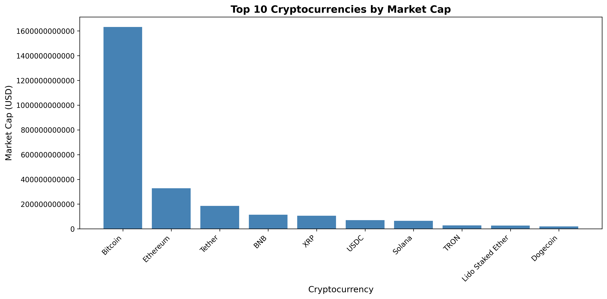
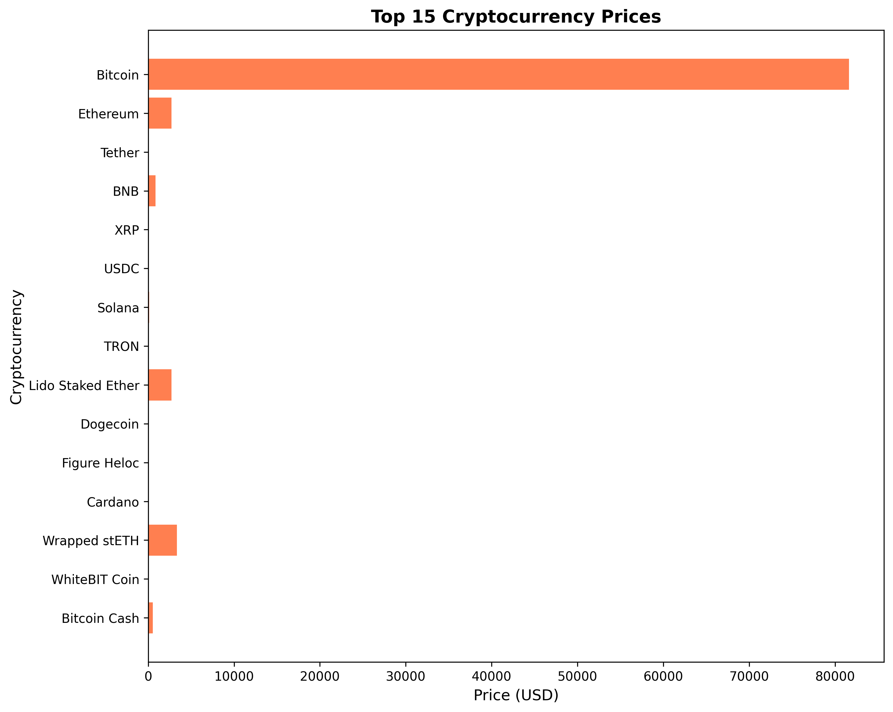
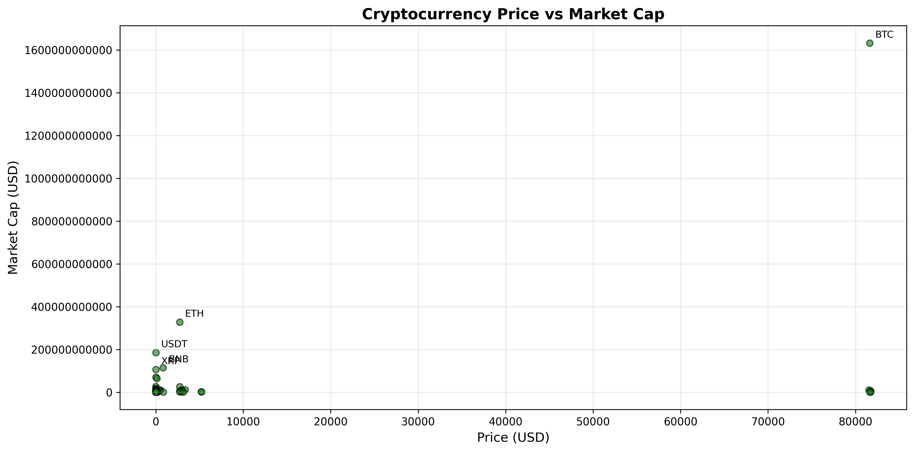

# Cryptocurrency ETL Pipeline

A simple ETL (Extract, Transform, Load) pipeline that fetches cryptocurrency market data from CoinGecko API and saves it to SQLite database or CSV file.

## Usage

1. **Install dependencies**:
   ```bash
   pip install -r requirements.txt
   ```

2. **Run the ETL pipeline**:
   ```bash
   python main.py
   ```

3. **Generate visualizations**:
   ```bash
   python visualize.py
   ```

## Flow

### 1. Extract
**File**: `extract/api_client.py`
- Fetches cryptocurrency market data from CoinGecko API
- Endpoint: `https://api.coingecko.com/api/v3/coins/markets`
- Returns raw JSON data in USD

### 2. Transform
**File**: `transform/clean_data.py`
- Converts raw JSON into pandas DataFrame
- Selects relevant columns: name, symbol, current_price, market_cap
- Renames columns for clarity: Name, Symbol, PriceUSD, MarketCap
- Sorts by market cap (descending)
- Adds a Rank column

### 3. Load
**Files**: `load/save_data_db.py` and `load/save_data_csv.py`
- **Database**: Saves to SQLite database (crypto.db)
- **CSV**: Saves to CSV file (crypto.csv)

## Configuration
**File**: `config.py`
- Database name: `crypto.db`
- Table name: `crypto_market`

## Visualization
**File**: `visualize.py`

Generate charts from the database:
```bash
python visualize.py
```

### Sample Charts

**Top 10 Cryptocurrencies by Market Cap**


**Market Share Distribution**


**Price Comparison**


**Price vs Market Cap Analysis**


## Project Structure
```
exercise-list-etl/
├── extract/
│   └── api_client.py       # Fetch data from API
├── transform/
│   └── clean_data.py       # Clean and transform data
├── load/
│   ├── save_data_db.py     # Save to SQLite database
│   └── save_data_csv.py    # Save to CSV file
└── config.py               # Database configuration
```
