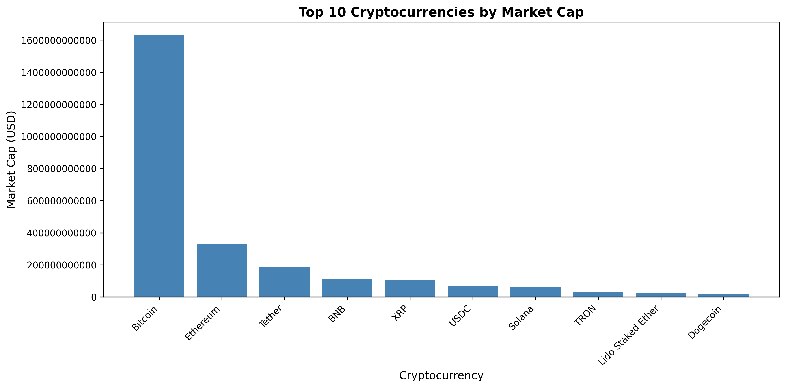
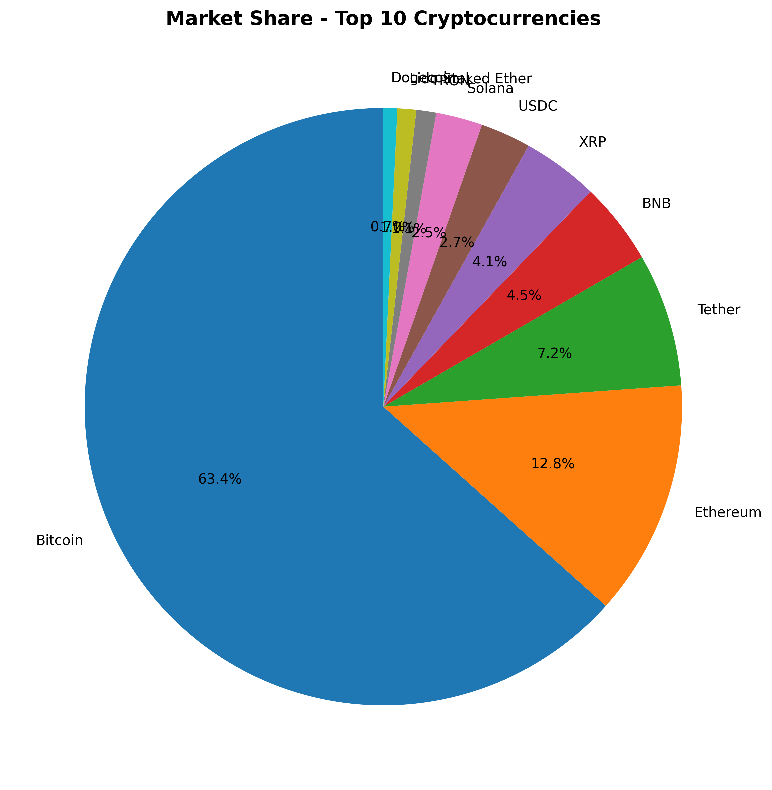
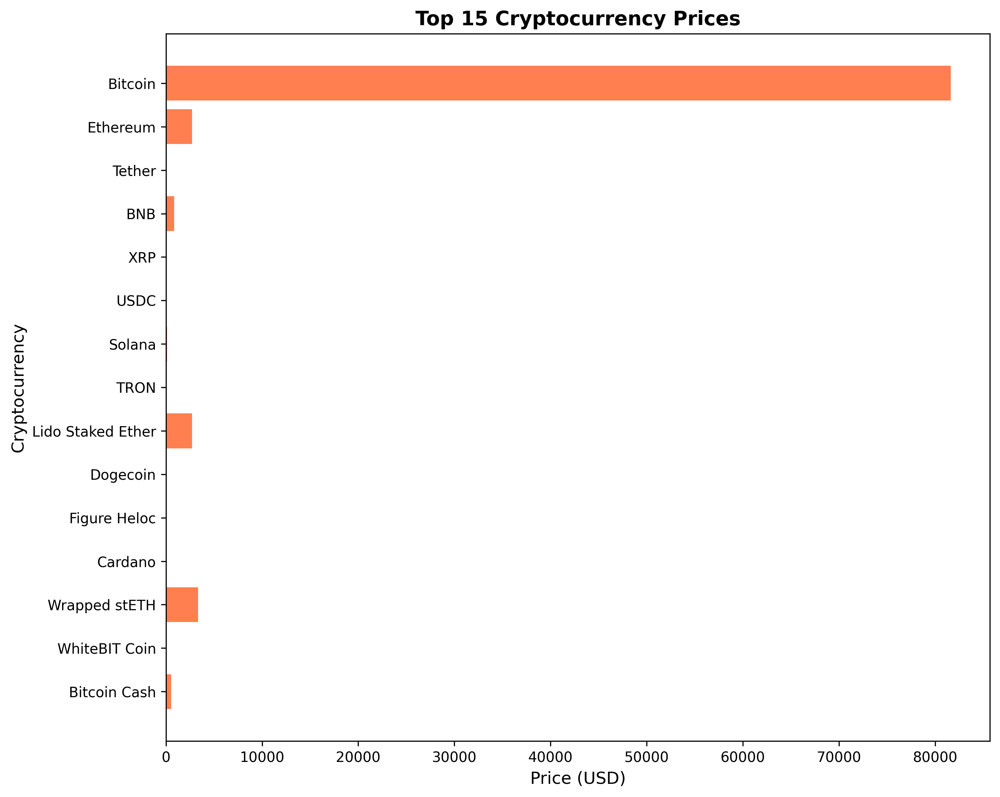
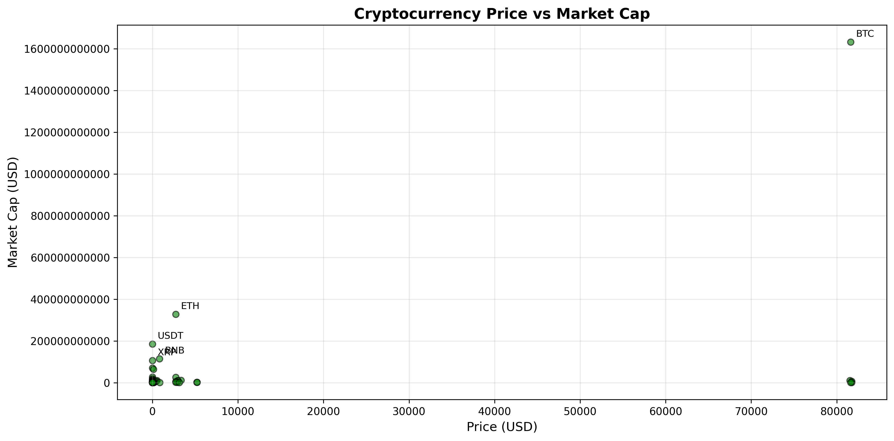

# Cryptocurrency ETL Pipeline with n8n Automation

An ETL (Extract, Transform, Load) pipeline that fetches cryptocurrency market data from CoinGecko API and automatically loads it to Google Sheets using n8n workflow automation.

## Features

- Fetches top 100 cryptocurrencies from CoinGecko API
- Transforms and cleans data with pandas
- Saves complete dataset to CSV (100 cryptos)
- Sends top 10 cryptos to Google Sheets via n8n webhook
- Automated workflow orchestration with n8n
- Optional SQLite database storage
- Data visualization with matplotlib

## Prerequisites

- Python 3.x
- n8n (running on localhost:5680)
- Google account (for Google Sheets integration)

## Installation

1. **Install Python dependencies**:
   ```bash
   pip install -r requirements.txt
   ```

2. **Set up n8n**:
   - Install n8n: `npm install n8n -g`
   - Start n8n: `n8n start`
   - Access: `http://localhost:5680`

## n8n Workflow Setup

Create a workflow in n8n with these nodes:

1. **Webhook Node**
   - HTTP Method: POST
   - Path: `crypto-report`
   - Response Mode: Immediately

2. **Code Node** (Extract Body)
   ```javascript
   const webhookData = $input.first().json;
   const cryptoData = webhookData.body;
   return cryptoData.map(crypto => ({ json: crypto }));
   ```

3. **Google Sheets - Clear**
   - Operation: Clear
   - Range: A:Z
   - Connect your Google account

4. **Google Sheets - Append**
   - Operation: Append or Update Row
   - Data Mode: Auto-Map Input Data to Columns

5. **Activate** the workflow

## Usage

### Run ETL Pipeline
```bash
python main.py
```

**Output:**
```
Saved 100 rows to crypto.csv
n8n webhook triggered successfully! Sent top 10 cryptos.
ETL completed!
```

### Generate Visualizations (Optional)
```bash
python visualize.py
```

## ETL Flow

```
Python Script (main.py)
    ↓
1. EXTRACT → CoinGecko API (100 cryptos)
    ↓
2. TRANSFORM → Clean DataFrame (Name, Symbol, Price, MarketCap, Rank)
    ↓
3. LOAD
    ├─→ CSV (all 100 cryptos)
    └─→ n8n Webhook (top 10)
            ↓
        n8n Workflow
            ├─→ Extract data
            ├─→ Clear old data
            └─→ Append to Google Sheets
```

### 1. Extract
**File**: [extract/api_client.py](extract/api_client.py)
- Fetches cryptocurrency market data from CoinGecko API
- Endpoint: `https://api.coingecko.com/api/v3/coins/markets`
- Returns: Raw JSON data with 100 cryptocurrencies

### 2. Transform
**File**: [transform/clean_data.py](transform/clean_data.py)
- Converts raw JSON into pandas DataFrame
- Selects relevant columns: name, symbol, current_price, market_cap
- Renames columns: Name, Symbol, PriceUSD, MarketCap
- Sorts by market cap (descending)
- Adds Rank column (1-100)

### 3. Load
**Files**: [load/save_data_csv.py](load/save_data_csv.py) and [main.py](main.py)
- **CSV**: Saves all 100 cryptos to `crypto.csv`
- **n8n Webhook**: Sends top 10 cryptos as JSON
- **Google Sheets**: n8n writes top 10 to Google Sheets
- **Optional**: SQLite database (commented out in main.py)

## Configuration

**File**: [config.py](config.py)
- Database name: `crypto.db`
- Database path: `crypto.db`
- Table name: `crypto_market`

**Webhook URL**: [main.py](main.py#L16)
- Default: `http://localhost:5680/webhook-test/crypto-report`
- Top cryptos limit: 10 (configurable)

## Visualization

**File**: [visualize.py](visualize.py)

Generate charts from the database:
```bash
python visualize.py
```

### Sample Charts

**Top 10 Cryptocurrencies by Market Cap**


**Market Share Distribution**


**Price Comparison**


**Price vs Market Cap Analysis**


## Project Structure

```
exercise-list-etl/
├── extract/
│   └── api_client.py       # Fetch data from CoinGecko API
├── transform/
│   └── clean_data.py       # Clean and transform data
├── load/
│   ├── save_data_csv.py    # Save to CSV file
│   ├── save_data_db.py     # Save to SQLite database (optional)
├── main.py                 # Main ETL orchestration + n8n webhook
├── config.py               # Database configuration
├── visualize.py            # Generate charts
└── requirements.txt        # Python dependencies
```

## Automation

### Option 1: Windows Task Scheduler
Schedule `python main.py` to run daily/hourly

### Option 2: n8n Schedule Trigger
Add a Schedule Trigger node in n8n before the webhook to run automatically

## Why Top 10 Only to Google Sheets?

Google Sheets API has rate limits:
- 60 write requests per minute per user

Sending 100 cryptos would exceed this limit. The top 10 provides:
- Most relevant cryptocurrencies by market cap
- Clean, readable dashboard
- Stays well within API rate limits

The complete dataset (100 cryptos) is always saved to `crypto.csv`.

## Learning Outcomes

This project demonstrates:
- ✓ ETL pipeline architecture
- ✓ API data extraction
- ✓ Data transformation with pandas
- ✓ Webhook integration
- ✓ n8n workflow automation
- ✓ Google Sheets API integration
- ✓ CSV file handling
- ✓ Data visualization
- ✓ Error handling
- ✓ Code documentation

## License

MIT License
